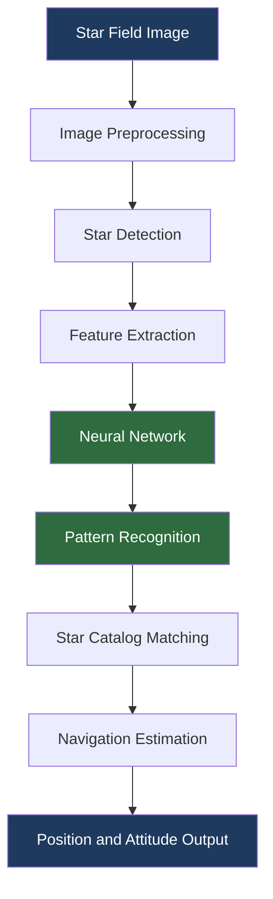

# System Architecture

> **Status:** Planned architecture — no components have been implemented yet.
> This document describes the intended design and will be updated as implementation progresses.

---

## Overview

StellarX-StarNav-AI is designed as a modular, pipeline-based system. Each stage is independently implemented, tested, and optimized, and communicates with adjacent stages through well-defined interfaces. The pipeline takes a raw star-field image as input and produces a spacecraft position and attitude estimate as output.

---

## Architecture Diagram



---

## Component Descriptions

### 1. Image Acquisition / Input

**Source module:** `src/` (entry point, to be defined)

The system ingests star-field images captured by an onboard imaging device. Supported formats and resolution requirements are to be determined during dataset preparation (Phase 1). The input component is responsible for loading image data and passing it to the preprocessing stage in a consistent internal format.

---

### 2. Image Preprocessing

**Source module:** `src/preprocessing/image_preprocessing.py`

Raw star-field images contain noise, sensor artifacts, and background illumination gradients that must be removed before star detection can proceed. The preprocessing component applies a sequence of image-level transformations to produce a clean, normalised image.

Planned operations (specific algorithms to be selected during Phase 2):
- Background estimation and subtraction
- Noise reduction / smoothing
- Intensity normalisation
- Thresholding preparation

---

### 3. Star Detection

**Source module:** `src/preprocessing/star_detection.py`

The star detection component locates point-source objects in the preprocessed image that correspond to stars. It returns a list of detected star candidates with their pixel coordinates and brightness measurements.

Planned outputs per detected star:
- Centroid coordinates (x, y)
- Integrated brightness / magnitude estimate
- Morphological descriptors (if applicable)

Detection algorithm to be determined during Phase 2.

---

### 4. Feature Extraction

**Source module:** `src/preprocessing/star_detection.py` (or a dedicated module, TBD)

From the list of detected stars, the feature extraction step constructs a representation suitable for input to the neural network. This may include inter-star angular distances, brightness ratios, geometric arrangements, or other characteristic descriptors.

Feature representation design is to be determined during Phase 3.

---

### 5. Neural Network

**Source module:** `src/models/star_pattern_model.py`

The neural network is the core recognition component. It takes the extracted feature representation as input and produces a classification or matching output that identifies the observed star pattern.

Architecture choices (CNN, graph network, transformer, or hybrid) are to be determined during Phase 3.

---

### 6. Pattern Recognition

**Source module:** `src/models/inference.py`

The pattern recognition component wraps the neural network inference step. It manages model loading, input preparation, forward pass execution, and output post-processing. It returns a recognized pattern identifier along with a confidence score.

---

### 7. Star Catalog

**Source module:** `src/catalog/catalog_loader.py`

The star catalog is a structured reference dataset containing known star positions, magnitudes, and identifiers. The catalog loader provides a consistent interface for querying the catalog during matching.

Catalog source and format to be determined during Phase 1 dataset preparation.

---

### 8. Pattern Matching

**Source module:** `src/catalog/pattern_matcher.py`

The pattern matcher takes the neural network's recognized pattern output and searches the star catalog for the corresponding entry. It returns the matched catalog record and a match confidence value.

Matching algorithm to be determined during Phase 4.

---

### 9. Navigation Estimation

**Source modules:** `src/navigation/attitude_estimator.py`, `src/navigation/position_estimator.py`

Using the matched catalog entry, the navigation estimation component computes:
- **Attitude** — spacecraft orientation (roll, pitch, yaw or quaternion representation)
- **Position** — spacecraft position where the methodology supports it

Estimation algorithms to be determined during Phase 5.

---

### 10. Output / Visualization

**Source module:** `src/utils/visualization.py`, `app/streamlit_app.py`

The output component formats and presents the navigation result. During development, results are visualized using Matplotlib helpers. The Streamlit application (Phase 7) provides an interactive interface for uploading images, running the pipeline, and inspecting results with confidence and latency metrics.

---

## Module Dependency Map

```
app/streamlit_app.py
    └── src/navigation/attitude_estimator.py
    └── src/navigation/position_estimator.py
        └── src/catalog/pattern_matcher.py
            └── src/catalog/catalog_loader.py
            └── src/models/inference.py
                └── src/models/star_pattern_model.py
        └── src/preprocessing/star_detection.py
            └── src/preprocessing/image_preprocessing.py
    └── src/utils/visualization.py
```

---

## Design Principles

- **Modularity** — each component has a single well-defined responsibility and can be developed and tested independently.
- **Configuration-driven** — all tunable parameters are sourced from `config.yaml`; no hard-coded values in source files.
- **Reproducibility** — random seeds, dataset versions, and model checkpoints are tracked per experiment.
- **Efficiency** — the design targets deployment on resource-constrained spacecraft platforms; computational cost is a first-class concern.
- **Testability** — each module exposes a clean interface that can be exercised by unit tests in `tests/`.
